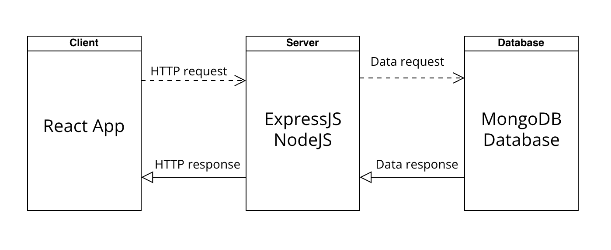

# cs361-babytime

Welcome to the Babytime Microservice! This microservice provides data for the "Babytime" web app, allowing you to retrieve information related to baby activities and schedules.

## Getting Started

### Prerequisites

Make sure you have the following installed:

- Node.js
- npm (Node Package Manager)

### How to Start
1. Clone the repository using Git.
2. Navigate to the "activity-rest" folder, run npm install, and then execute npm start.
3. Move to the "activity-ui" folder, run npm install, and then execute npm start.
4. The application will be accessible at http://localhost:8000.

## Communication

### 1. Client-side (React):
#### Requesting Data (Sending HTTP Reuqests):
- The frontend is responsible for sending HTTP requests to the server to perfrom various operations such as creating, reading, updating, and deleteing activities.
- It uses the Fetch API to make HTTP requests to the server's API endpoints. 
- For example:
```
const loadActivities = async () => {
    try {
      const response = await fetch('/activities');
      const data = await response.json();
      setActivities(data);
    } catch (error) {
      console.error("Error fetching activities:", error);
    }
  };
```

### 2. Server-side (Node.js and Express):
#### Receiving Data (Handling HTTP Requests):
- On the server side, you use Express.js to handle incoming HTTP requests.
- Using Routes and controllers.
- For example:
```
app.get('/activities/:_id', (req, res) => {
    const activityId = req.params._id;
    activities.findActivityById(activityId)
        .then(activity => { 
            if (activity !== null) {
                res.status(200).json(activity);
            } else {
                res.status(404).json({ Error: 'Resource not found' });
            }         
         })
        .catch(error => {
            res.status(400).json({ Error: 'Request failed' });
        });

});
```

### 3. Database (MongoDB):
#### Storing and Retrieving Data:
- MongoDB is used as the database to store and retrieve data.
- In the server-side code, you'll have functions to interact with the MongoDB database using a library like mongoose.
- For example: 
```
import mongoose from 'mongoose';
import 'dotenv/config';

mongoose.connect(
    process.env.MONGODB_CONNECT_STRING,
    { useNewUrlParser: true }
);


// Connect to to the database
const db = mongoose.connection;
// The open event is called when the database connection successfully opens
db.once("open", () => {
    console.log("Successfully connected to MongoDB using Mongoose!");
});

/**
 * Define the schema
 */

const activitySchema = mongoose.Schema({
    name: { type: String, required: true },
    start: { type: String, required: true },
    end: { type: String, required: false },
    amount: { type: Number, required: false },
    color: { type: String, required: false },
    memo: { type: String, required: false }
});
```
## UML Sequence Diagram



